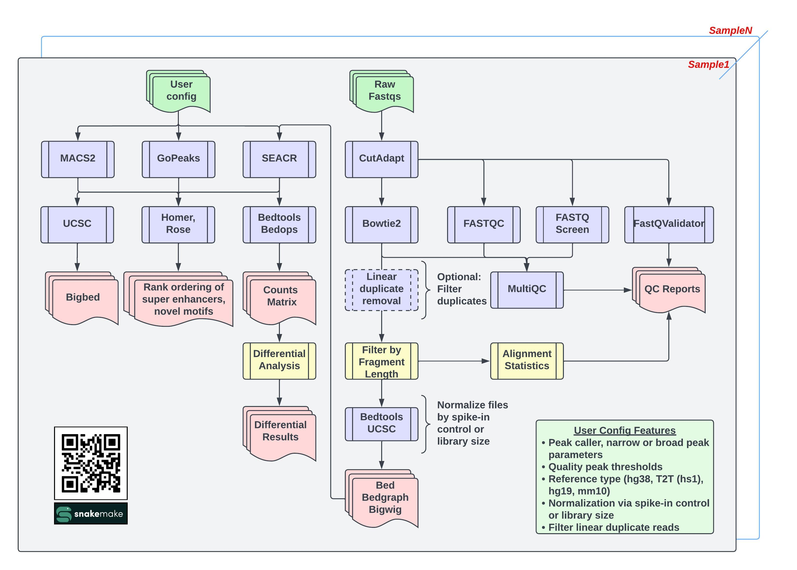

# Cut And Run anaLysIS pipeLinE [CARLISLE]

  
  
       

This snakemake pipeline is built to run on [Biowulf](https://hpc.nih.gov/).

For comments/suggestions/advice please reach out to [Vishal Koparde](mailto:vishal.koparde@nih.gov).

For detailed documentation on running the pipeline view the [documentation](https://CCBR.github.io/CARLISLE/) page.
